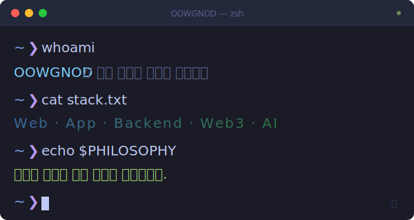

<picture>
  
</picture>

<br/>

## About

```
구조가 명확하면, 기능은 자연스럽게 따라온다.
```

- 기능 중심이 아닌 **구조 중심** 개발
- 구현 이전에 **제품 흐름 설계**를 우선
- 확장성을 전제로 한 **아키텍처 설계**
- AI를 설계 도구로 활용하여 **구조 검증과 개발 사이클을 가속**

<br/>

## Stack

**Frontend**

   

**Backend**

   

**Database**

   

**Web3**

   

**Infra**

   

<br/>

## How I Build

```
설계 → 검증 → 구현 → 최적화
```

- 인증 흐름을 제품 특성에 맞게 구조화
- 컨트롤러 → 서비스 → 레포지토리 계층 분리, 역할과 책임을 명확히 정의
- 공통 로직은 공유하되, 플랫폼별 차이는 어댑터 패턴으로 분리
- 모듈 단위 설계로 기능 추가 시 기존 코드 변경을 최소화
- 시퀀스 다이어그램, 상태 흐름도를 통해 구현 전 로직을 사전 검증
- 코드 생성, 마이그레이션, 배포 파이프라인의 자동화를 설계 단계에서 고려

<br/>

## Workflow

```
AI를 단순 코드 생성이 아닌, 제품 설계 전반의 사고 도구로 활용합니다.
```

- 아키텍처 설계 시 구조적 대안을 빠르게 탐색하고 검증
- 설계 → 구현 사이의 간극을 줄여 개발 사이클을 압축
- 반복적인 구현 패턴을 자동화하여 핵심 설계에 집중

<br/>

## Activity

<div align="center">
  
</div>

<br/>

<div align="center">
  
  &nbsp;
  
</div>

<br/>

---

<div align="center">
  <sub>기능을 만들기 전에 구조를 설계합니다.</sub>
</div>
